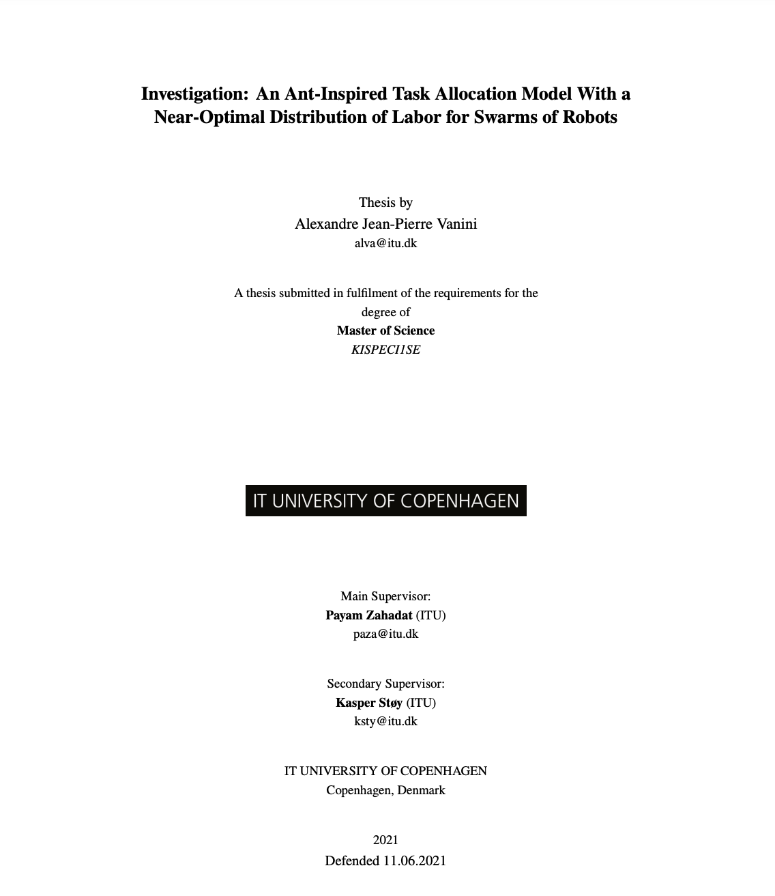

# Investigation: An Ant-Inspired Task Allocation Model With a Near-Optimal Distribution of Labor for Swarms of Robots.
Ant-Inspired Task Allocation Model Within a Swarm of Homogeneous Simulated Robotic-Agents

## Disclaimer
The content of this README has not been consistently updated, but you can find all the details of the project here:



<a href="./assets/MASTER_THESIS.pdf">Download PDF</a>

## You should now
- AITA = Ant-Inspired Task Allocation
- FAITA = Fully distributed Ant-Inspired Task Allocation
- PSI = Partitioning Social Inhibition
- RND = Random Task Allocation
- GTA = Greedy Task Allocation

AITA and FAITA are the main observed algorithms.

> WARNING: Only the main branch and the fully-distributed TA branch are (or supposed to be) "bugless". The other branches work for the implementation but are not to be reproduce for your own work as they might contain some sketchy but time saving workaround.

## What can be observed
The robot are dispatch from a starting point in an Arena. Their task is selected following the Task allocation model proposed in this paper: https://ssr.seas.harvard.edu/files/ssr/files/disc14-cornejo.pdf.
Throughout the simulation, Forager will collect resource from the outside world and gather them in the home area (blue). Then, nest processors will process the resource and move it to the cleaning area (pink) for it to e picked up and move to the waste area (orange).

### Communication

Communication is different for each TA, but there are some noise mechanisms implemented where possible.

#### AITA
The knowledge about a task are shared in the nest which serves as an information center where ant report their current task and ask for
a new assignment under specific conditions. This kind of communication is a centralized communication.

Conditions for ant task report:
- The ant is currently not carrying a resource (clear sign of an ant currently active in its assigned task)
- AND the ant is on the area `TYPE_HOME`
- The ant has not report its task since `600` simulation timestep

#### FAITA
The knowledge about a task is shared throughout the entire swarm (Distributed communication). This ensure robustness.

Conditions for ant task report:
- The ant is currently not carrying a resource (clear sign of an ant currently active in its assigned task)

## How to: Line command
```
> python simulation.py -r <nb_robot> -p <np_point> -s <is_simulation_visible> -b <do_robot_lose_battery> -t <do_record_trail> -a <avoidance_activation> -n <[0,1]> -f <stats_file_name.csv> -e <exp_number (1 or 2)>
> python simulation.py -r 40 -p 2000 -s True -b False -t False -a True -n 0.3 -f stats.csv -e 1

-r = Number of simulated robot
-p = Number of randomly generated resource
-s = Show visualisation
-b = Active battery effects
-t = Record robot's path
-a = Specifies if the robot should avoid one another
-n = Probability of communication failure, between 0 and 1
-f = Specifies the name the output stats file should have
-e = Specifies which of the two experiments the program will be running
```

## In-pygame command shorcut
```
q -> Quit the simulation
y -> Shows sensors and collision box
r -> Increments resrouce's needs by a random number -> Not up-to-date
x -> if -t = True, show where each robot have been during the simulation
p -> Pause the simulation
right-click or click 7 -> add a robot to the simulation Not up-to-date
left-click -> spread a random number of point in a 100x100 area around the position of the click
click 6 -> Remove a robot from the simulation Not up-to-date
v -> Delete 1/3 of the robots (random) Not up-to-date
b -> Delete 1/3 of the robots performing foraging Not up-to-date
n -> Delete 1/3 of the robots performing nest processing Not up-to-date
m -> Delete 1/3 of the robots performing cleaning Not up-to-date
```

Results of experiment 1 for AITA. 
```
- 40 robots
- No foraging demand increase
- Collision on
- No communication failure
- Foraging demand starts at 50
```


Results of experiment 1 for FAITA. 
```
- 40 robots
- No foraging demand increase
- Collision on
- No communication failure
- Foraging demand starts at 50
```


Results of experiment 1 over all the different TAs. 
```
- 40 robots
- No foraging demand increase
- Collision on
- No communication failure
- Foraging demand starts at 50
```
